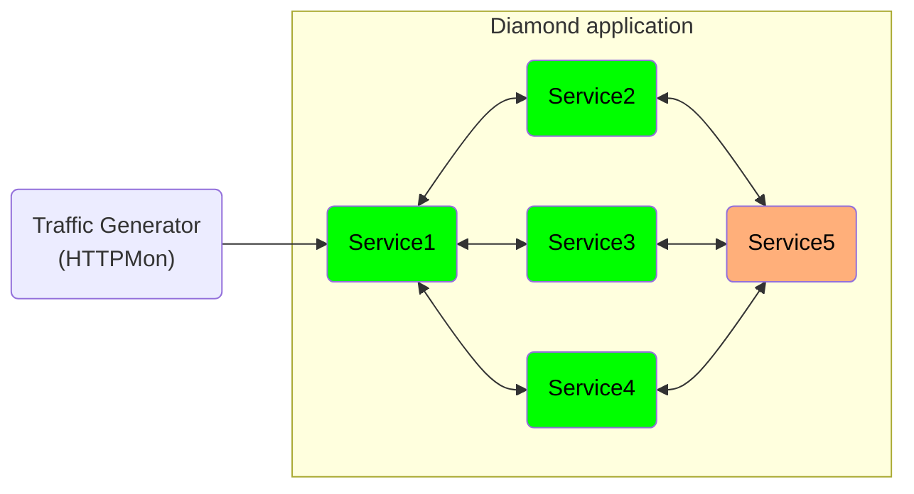

# Experiments to get an intuition about how retry mechansim works

This experiments is going to be presented in a meeting with David, Bradley, Johan , and Cristian on Feb 1st. 

The experiments consist of generating the traffic to a diamond application with various retry parameters and a static circuit breaker configuration. In general the architecture looks like:

In the above architecture, the `second service` is more complex than the `first service` in terms of processing time per requests. The `first service` requires `0.01 ms` while the `second service` requires `5ms` time to process the requests. 