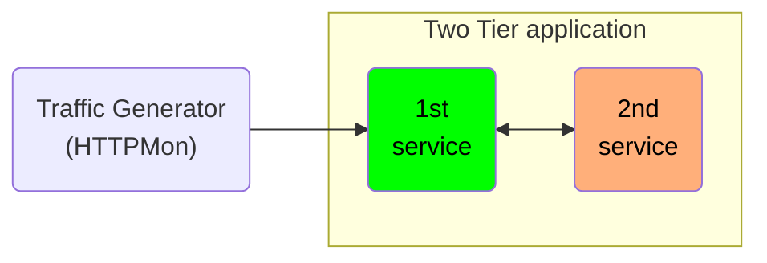

In general the architecture looks like:

In the above architecture, the `second service` is more complex than the `first service` in terms of processing time per requests. The `first service` requires `0.01 ms` while the `second service` requires `5ms` time to process the requests. 